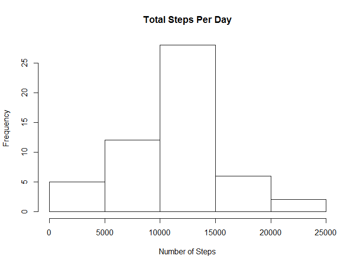
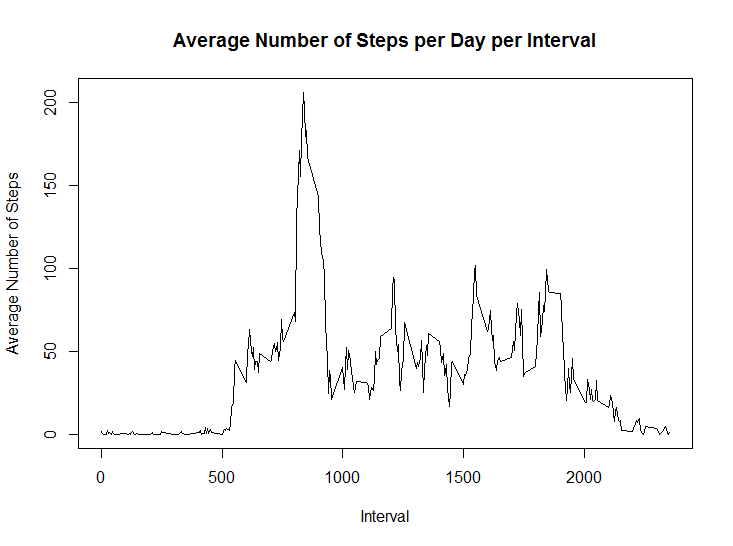
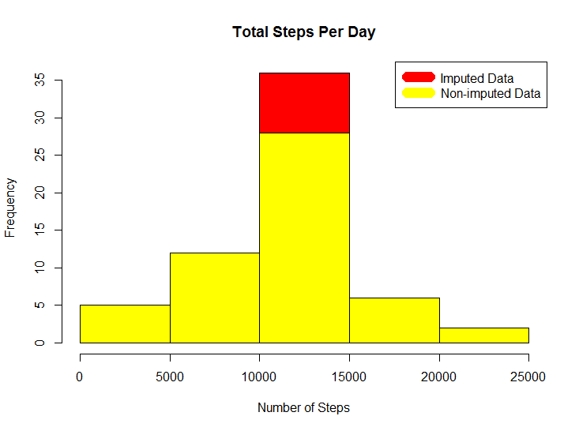
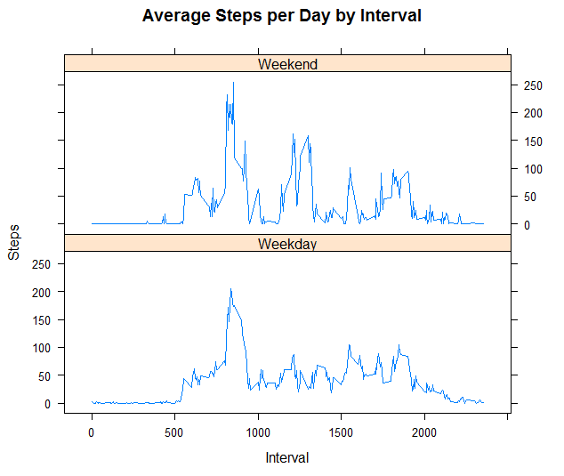

Reproducible Research Project 1
================
Connie
May 21, 2017

This assignment makes use of data from a personal activity monitoring device. This device collects data at 5 minute intervals through out the day. The data consists of two months of data from an anonymous individual collected during the months of October and November, 2012 and include the number of steps taken in 5 minute intervals each day.

Data
----

The data can be downloaded from the course web site:

-   **Dataset** - [Activity Monitoring data](https://github.com/connie0701/RepData_PeerAssessment1/blob/master/activity.zip)

The variables included in this dataset are:

-   **Steps** - Number of steps taking in a 5-minute interval (missing values are coded as NA)

-   **Date** - The date on which the measurement was taken in MM/DD/YYYY format

-   **Interval** - Identifier for the 5-minute interval in which measurement was taken

The dataset is stored in a comma-separated-value (CSV) file and there are a total of 17,568 observations in this dataset.

Loading and preprocessing the data
----------------------------------

Loading the data

``` r
activity <- read.csv("activity.csv")
```

Transfer the data into a datafram

``` r
activity<-as.data.frame(activity)
```

What is mean total number of steps taken per day?
-------------------------------------------------

Calculate the total number of steps taken per day

``` r
steps_per_day <- aggregate(steps ~ date, activity, sum)
```

Histogram of the total number of steps taken each day

``` r
hist(steps_per_day$steps, xlab="Number of Steps", main = paste("Total Steps Per Day"))
```



The mean and median of the total number of steps taken per day

``` r
stepmean<-mean(steps_per_day$steps)

stepmedian<-median(steps_per_day$steps)
```

The `mean` of total number of steps taken per day is 10766 steps.

The `median` of total number of steps taken per day is 10765 steps.

What is the average daily activity pattern?
-------------------------------------------

Make a time series plot of the 5-minute interval (x-axis) and the average number of steps taken, averaged across all days (y-axis)

``` r
steps_per_interval <- aggregate(steps ~ interval, activity, mean)

plot(steps_per_interval$interval,steps_per_interval$steps, type="l", xlab="Interval", ylab="Average Number of Steps",main="Average Number of Steps per Day per Interval")
```



Which 5-minute interval, on average across all the days in the dataset, contains the maximum number of steps?

``` r
max_interval <- steps_per_interval[which.max(steps_per_interval$steps),1]
```

The maximum number of steps for a 5-minute interval was 206 steps.

The 5-minute interval which had the maximum number of steps was the 835 interval.

Imputing missing values
-----------------------

Calculate and report the total number of missing values in the dataset

``` r
missing_data<-nrow(activity[is.na(activity$steps),])
```

The total number of missing value is 2304.

Create a new dataset that is equal to the original dataset but with the missing data filled in by substituting the missing steps with the average 5-minute interval based on the day of the week.

``` r
data1<- steps_per_interval$steps[match(activity$interval, steps_per_interval$interval)]

newdata <- transform(activity, steps = ifelse(is.na(activity$steps), data1, activity$steps))
```

Make a histogram of the total number of steps taken each day.

``` r
newstep_per_day<-aggregate(steps ~ date, newdata, sum)

hist(newstep_per_day$steps, breaks=4, main = paste("Total Steps Per Day"), xlab="Number of Steps", col="red")

hist(steps_per_day$steps, breaks=4, main = paste("Total Steps Per Day"), xlab="Number of Steps", col= "yellow", add =T)

legend("topright", c("Imputed Data", "Non-imputed Data"), col=c("red", "yellow"), lwd=13)
```



Calculate new mean and median for imputed data.

``` r
newmean <- mean(newstep_per_day$steps)

newmedian <- median(newstep_per_day$steps)

mean_diff <- newmean - stepmean

median_diff <- newmean - stepmedian

total_diff <- sum(newstep_per_day$steps) - sum(steps_per_day$steps)
```

The new mean of the imputed data is 10766 steps compared to the old mean of 10766 steps.

The new median of the imputed data is 10766 steps compared to the old median of 10765 steps.

The difference between total number of steps between imputed and non-imputed data is 86130.

Are there differences in activity patterns between weekdays and weekends?
-------------------------------------------------------------------------

Create a new factor variable in the dataset with two levels - "weekday" and "weekend"

``` r
newdata$day <- weekdays(as.Date(newdata$date))

newdata$Daytype <- ifelse(newdata$day %in% c("Saturday", "Sunday"), "Weekend","Weekday")
```

Make a panel plot containing a time series plot of the 5-minute interval (x-axis) and the average number of steps taken, averaged across all weekday days or weekend days (y-axis).

``` r
newsteps_per_interval <- aggregate(steps ~ interval + Daytype, newdata, mean)

library(lattice) 

xyplot(steps ~ interval|Daytype, data=newsteps_per_interval, main="Average Steps per Day by Interval",xlab="Interval", ylab="Steps",layout=c(1,2), type="l")
```


